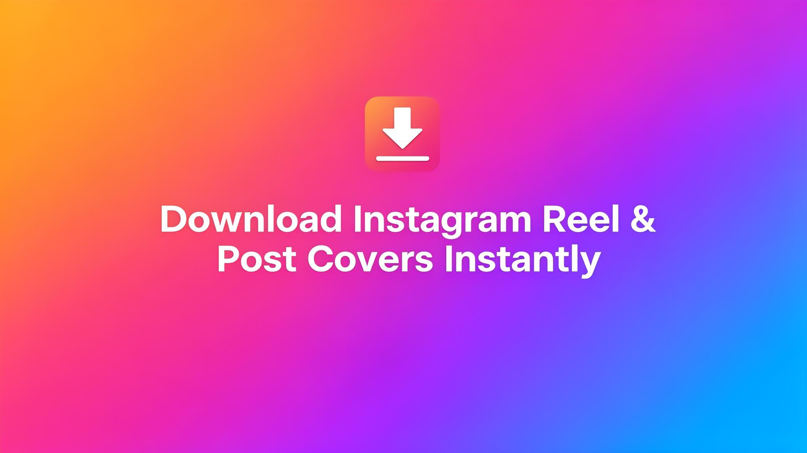

# InstaCover

### Download Instagram Reel & Post Cover Images Instantly

<p>
A fast and minimal tool to extract Instagram Reel and Post cover images.  
Paste a link and download the thumbnail instantly — no login required.
</p>

<br>

<div align="center">

</div>

<br><br>

<div align="center">
<a href="https://thinakaranmanokaran.github.io/instacover_download">

</a>
</div>

---

## ✨ Features

* 📥 Download Instagram **Reel cover images**
* 🖼 Download **Post thumbnails**
* ⚡ Instant extraction
* 🎨 Minimal Instagram-style UI
* 📱 Installable as **PWA**
* 🔒 No login required
* 🆓 Completely free

---

## 🛠 Tech Stack

* **React**
* **Vite**
* **TypeScript**
* **Tailwind CSS**
* **React Query**
* **ShadCN UI**

---

## 🌐 Live Website
### https://thinakaranmanokaran.github.io/instacover_download


---

## 📸 Preview

<div align="center">



</div>

---

## 📂 Project Structure

```
src/
components/
pages/
lib/
public/
manifest.json
sw.js
```

---

## 🚀 Installation

Clone the repository:

```bash
git clone https://github.com/thinakaranmanokaran/instacover-download.git
```

Install dependencies:

```bash
npm install
```

Run development server:

```bash
npm run dev
```

Build project:

```bash
npm run build
```

---

## 👨‍💻 Author

### Thinakaran Manokaran

🌐 https://thinakaran.dev

---

## 📄 License

This project is licensed under the **MIT License**.

See the [LICENSE](LICENSE) file for details.

---

Developed by **Thinakaran Manokaran**